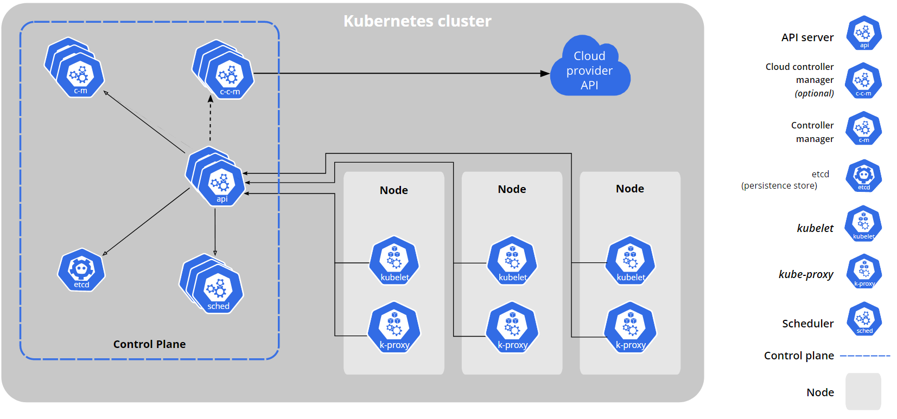

# Kubernetes

## What is Kubernetes&#x20;

Kubernetes (sometimes shortened to K8s with the 8 standing for the number of letters between the “K” and the “s”) is an open-source system to deploy, scale, and manage containerized applications anywhere.

It is also called Container-Orchestration tool.

## What is Kubernetes Cluster?

A Kubernetes cluster is a set of nodes that run containerized applications. Containerizing applications packages an app with its dependences and some necessary services. They are more lightweight and flexible than virtual machines. In this way, Kubernetes clusters allow for applications to be more easily developed, moved and managed.

Kubernetes clusters allow containers to run across multiple machines and environments: virtual, physical, cloud-based, and on-premises. Kubernetes containers are not restricted to a specific operating system, unlike virtual machines. Instead, they are able to share operating systems and run anywhere.

Kubernetes clusters are comprised of **one** master node and a **number** of worker nodes. These nodes can either be physical computers or virtual machines, depending on the cluster.

The master node controls the state of the cluster; for example, which applications are running and their corresponding container images. The master node is the origin for all task assignments. It coordinates processes such as:

* Scheduling and scaling applications
* Maintaining a cluster’s state&#x20;
* Implementing updates&#x20;

The worker nodes are the components that run these applications. Worker nodes perform tasks assigned by the master node. They can either be virtual machines or physical computers, all operating as part of one system.&#x20;

There must be a minimum of one master node and one worker node for a Kubernetes cluster to be operational. For production and staging, the cluster is distributed across multiple worker nodes. For testing, the components can all run on the same physical or virtual node. &#x20;

A **namespace** is a way for a Kubernetes user to organize many different clusters within just one physical cluster. Namespaces enable users to divide cluster resources within the physical cluster among different teams via resource quotas. For this reason, they are ideal in situations involving complex projects or multiple teams.  &#x20;

## Kubernetes Cluster Architecture

<figure><figcaption></figcaption></figure>

<figure><figcaption></figcaption></figure>
